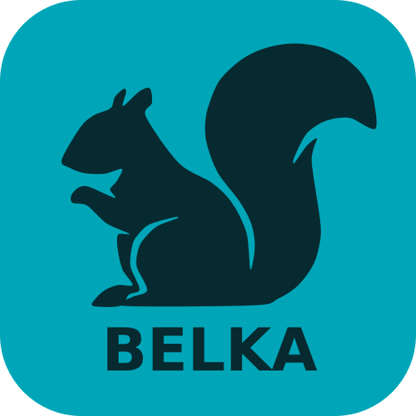
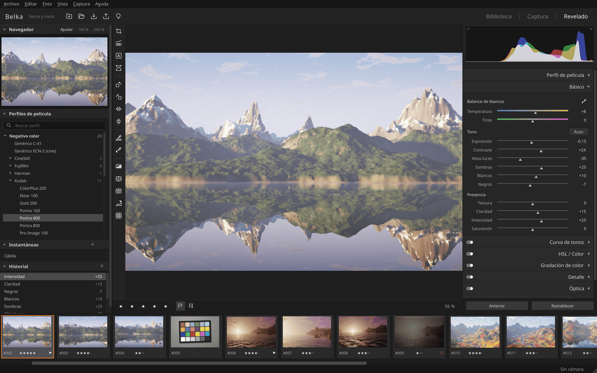

<p align="center"></p>

# Belka

**Tu cámara escanea película; tu pantalla es la luz.** Belka digitaliza negativos en Ubuntu: la **pantalla de la
computadora es la fuente de luz**, la **cámara se controla por USB** desde la app y el negativo se **invierte
automáticamente** con perfiles por película, con un módulo de revelado al estilo de Lightroom Classic.

[Página del proyecto](https://romeruu-dev.github.io/belka/) · *English: see the project page.*



## Qué hace

- **Panel de luz en la pantalla.** Ilumina solo la zona del formato (35 mm, medio cuadro, 120 6×4.5/6×6/6×7/6×9,
  4×5) medida en milímetros reales, con el resto en negro para no meter destellos. Se mueve con ratón o flechas,
  tiene marcas de registro para alinear un adaptador y una regla para calibrar la escala de la pantalla.
- **Tres modos de luz:** blanca; **tinte calibrado**, que vuelve la luz azul-cian para neutralizar la máscara naranja
  y aprovechar todo el rango del sensor; y **RGB secuencial**, tres tomas con rojo, verde y azul puros combinadas en
  una imagen con mejor separación de color (como un escáner).
- **Cámara por USB (libgphoto2):** detección, conexión (libera la cámara si GNOME la montó como disco), ISO,
  velocidad, diafragma, calidad, destino, vista en vivo invertida con ampliación 1–8× para enfocar, foco motorizado
  y autoenfoque. Pensada para la **Nikon D780** y funciona con cualquier cámara que libgphoto2 controle (Canon, Sony,
  Fujifilm, Panasonic…).
- **Inversión por densidad** con 44 perfiles de película (C-41, ECN-2, B/N y diapositiva), base medida en el borde,
  gris neutro, temperatura/tinte, exposición, contraste, negros/blancos, saturación y curva de papel.
- **Revelado como Lightroom Classic** (0.2): módulos Biblioteca · Captura · Revelado; barra de herramientas con
  íconos junto a la foto (recortar y enderezar, línea de nivel, Upright, perspectiva, rotar, voltear, cuentagotas de
  base y de balance de blancos, antes/después, recorte de tonos, zoom); **histograma que se arrastra** por zonas
  (negros, sombras, exposición, altas luces, blancos); paneles Básico, Curva de tonos (paramétrica y por puntos,
  RGB/R/G/B), HSL / Color, Gradación de color, Detalle (enfoque y reducción de ruido), Óptica (distorsión y viñeteo),
  Transformar (Upright Auto/Nivel/Vertical/Completo, perspectiva vertical y horizontal, rotar, aspecto, escala,
  desplazamiento, restringir recorte) y Efectos (viñeta post-recorte y grano); navegador, perfiles de película con
  buscador, instantáneas, historial con deshacer/rehacer, copiar/pegar/sincronizar ajustes, estrellas y banderas.
- **Encuadre automático:** detecta el fotograma entre las perforaciones y lo recorta; al enderezar, el recorte se
  queda dentro del fotograma sin mostrar borde de película.
- **Flat-field:** una foto de la luz sin película corrige el viñeteo del objetivo y la luz desigual de la pantalla.
- **Rollos:** cada rollo es una carpeta con los RAW originales intactos, ajustes por fotograma, base común del rollo,
  "aplicar a todo el rollo" y perfiles propios guardados desde un rollo real.
- **Exportación** a TIFF de 16 bits y JPEG con perfil ICC sRGB, o "plana lineal" para seguir editando en darktable o
  RawTherapee.
- **Clic derecho** en la foto y en la tira: herramientas, ajustes, calificación y marcas, exportar, mostrar en la
  carpeta, **quitar del rollo** o **eliminar del disco** (a la papelera, recuperable) y **eliminar las rechazadas**
  de una vez: las capturas fallidas se marcan con X y se borran con Ctrl+Retroceso.
- **Automáticos:** tono automático (Ctrl+U, o Mayús+doble clic en un deslizador de Tono) y, al capturar, la
  velocidad sugerida para exponer bien la base se aplica a la cámara con un clic.
- **Upright guiado:** traza de 2 a 4 líneas sobre bordes que deban quedar verticales u horizontales (Mayús+T) y la
  perspectiva se corrige sola; las guías se pueden mover después. Cuadrícula de referencia (Ctrl+Alt+O).
- **Cámaras:** controles por marca (Nikon, Canon, Sony, Fujifilm, Panasonic, OM System/Olympus, Pentax, Sigma,
  Leica) en `belka/data/cameras.json`, con el modo USB que hay que elegir en cada una, y una lista de los modelos
  que libgphoto2 puede controlar (Captura → Cámaras compatibles…).
- Interfaz en español e inglés (según el idioma del sistema).

## Instalación

```bash
git clone https://github.com/ROMERUU-dev/belka.git
cd belka
./scripts/install.sh
```

Crea un entorno de Python en `~/.local/share/belka/venv` (sin `sudo`), el comando `belka` y el icono en
Aplicaciones. Las ruedas de `rawpy` y `gphoto2` traen LibRaw y libgphoto2 incluidos. `./scripts/uninstall.sh` lo
quita sin tocar tus rollos.

Para desarrollo: `python3 -m venv .venv && .venv/bin/pip install -r requirements.txt pytest`, luego
`.venv/bin/python -m belka`.

## Montaje

1. **Pantalla horizontal** (laptop abierta a 180° o monitor acostado) y la cámara encima, perpendicular, con
   objetivo macro, en estativo o tripié.
2. **Película a 5–10 mm de la pantalla, con difusor** (acrílico opalino de 2–3 mm o papel vegetal) entre ambas: si
   la película toca la pantalla, la rejilla de píxeles sale en la foto. Esto es lo que resolverá el adaptador.
3. **Brillo al máximo** y **luz nocturna desactivada**: tiñe la luz y cambia con la hora. Belka avisa y puede
   apagarla mientras está abierto.
4. **1/30 s o más lento:** muchas pantallas atenúan con PWM y a velocidades rápidas aparecen bandas.
5. Formato **RAW** (NEF). Exponer para que la base de la película quede alta sin saturarse.

Con **una sola pantalla**, el panel de luz ocupa la pantalla completa: se captura desde dentro con **Espacio** y
**Esc** regresa a la app. Con **dos pantallas** (p. ej. la laptop acostada como luz y un monitor externo), el panel va
en una y la app en la otra.

## Flujo de trabajo

1. **Archivo → Nuevo rollo**, con nombre y película.
2. **Conectar** la cámara. **Encender luz** y colocar la película sobre la zona iluminada.
3. Opcional, una vez por sesión: **flat-field** (en el panel, F dos veces sin película) y **calibrar tinte** (T con
   la película puesta; repetirlo afina).
4. Vista en vivo, enfocar a 4–8× sobre el grano y **capturar** (Espacio).
5. Ajustar a la derecha: **Medir en el borde** sobre película sin exponer da la base exacta; **Usar esta base en
   todo el rollo** la fija para que todos los fotogramas salgan consistentes.
6. Revelar a la derecha (o en Revelado, D) y **Exportar** (Ctrl+Mayús+E).

Atajos, los de Lightroom Classic donde existen:

| | |
|---|---|
| Módulos | G Biblioteca · Ctrl+Alt+2 Captura · D Revelado |
| Herramientas | R recortar (Enter aplica, Esc cancela, X gira el recuadro) · S enderezar con una línea · Mayús+U Upright · Mayús+T Upright guiado · Ctrl+[ / Ctrl+] rotar · Mayús+H / Mayús+V voltear · B medir base · W balance de blancos · Ctrl+U tono automático |
| Vista | N negativo · \\ antes/después · Y lado a lado · J recorte de tonos · Ctrl+Alt+O cuadrícula · Z o Espacio 1:1 / ajustar · Tab ocultar paneles · F6 tira · F7 / F8 paneles |
| Ajustes | Ctrl+Z / Ctrl+Mayús+Z deshacer / rehacer · Ctrl+Mayús+C / V copiar / pegar · Ctrl+Alt+V ajustes del anterior · Ctrl+Mayús+S sincronizar · Ctrl+Mayús+R restablecer · Ctrl+N instantánea |
| Fotogramas | ←/→ · 0–5 estrellas · P elegida · X rechazada · U sin marca · Supr quitar o eliminar · Ctrl+Retroceso eliminar rechazadas |
| Rollo | Ctrl+Mayús+N nuevo · Ctrl+O abrir · Ctrl+Mayús+I importar · Ctrl+Mayús+E exportar · L panel de luz · Espacio capturar · F1 guía |

## Cómo invierte

Para cada canal `c` de la cámara, sin balance de blancos ni matriz de color:

```
T_c = I_c / flat_c                  señal lineal corregida por flat-field
D_c = −log10(T_c / base_c)          densidad sobre la base (la máscara naranja)
x_c = (D_c − lo_c) / (hi_c − lo_c)  exposición logarítmica normalizada, 0 sombra … 1 blanco
x  ← M·x                            separación: deshace la mezcla de tintes entre canales
L_c = 2^((x_c − 1)·S + EV + WB_c)   luz de la escena (S = pasos que cubre la película)
y  = papel(L)                       curva logística de papel fotográfico → sRGB
```

`lo`/`hi` mezclan dos estimaciones con el control **Auto-balance**: la física (la base es el negro y las capas
mantienen las pendientes `gamma` del perfil) y niveles automáticos por canal de la imagen. Como la película registra
exposición logarítmica, el balance de blancos y el gris neutro son sumas en `x`. Al medir contra la base, el color de
la luz se cancela: por eso el tinte calibrado y el modo RGB no cambian el resultado, solo el ruido.

Los **perfiles** guardan las pendientes por capa, la densidad típica de la base, la separación, el contraste de papel
y la saturación. Los incluidos salen de curvas características publicadas y son **aproximados**. Para afinarlos con tu
cámara y tu luz: revela un fotograma con buena base y gris neutro y usa **Guardar como perfil de película**; ese
perfil mide las pendientes efectivas y queda listo para usarse con auto-balance bajo en el resto del rollo.

## Revelado después de invertir

La inversión entrega una imagen sRGB y encima se aplican, en este orden, los ajustes de estilo Lightroom
(`belka/core/adjust.py`): altas luces/sombras (filtro bilateral sobre la luminancia, sin halos), textura y
claridad, intensidad, curvas paramétrica y por puntos, HSL y gradación de color en OKLab/OKLCh, reducción de
ruido, enfoque, viñeta post-recorte y grano. La geometría va antes de invertir (`belka/core/transform.py`):
corrección de lente, perspectiva y enderezado con una homografía, y el recorte. El análisis de la película (base,
niveles, fotograma) se mide sin transformar, así que enderezar nunca cambia el color. Los radios (enfoque, grano,
claridad) están en píxeles de resolución completa, para que la vista previa y la exportación coincidan.

## Estado

- Probado con la **Nikon D780** real (conexión, vista en vivo, captura y NEF); más de 600 pruebas automáticas
  (`.venv/bin/python -m pytest`) con negativos sintéticos y una cámara de prueba.
- Otras plataformas (Windows, macOS, ARM): ver [docs/plataformas.md](docs/plataformas.md).
- La 0.2 añade el revelado estilo Lightroom; el historial vive en memoria (se pierde al cerrar el rollo), las
  instantáneas se guardan en el rollo.

## Hoja de ruta

- Perfiles de cámara (matrices de separación medidas) y calibración con carta de color sobre película.
- Lote de rollo completo (captura en serie avanzando la tira) e historial guardado en el rollo.
- Pinceles y degradados locales, como los de Lightroom.
- **Adaptador para monitor** impreso en 3D: porta-tiras 35 mm / 120 con difusor a distancia fija y marcas de
  registro que coinciden con las del panel (preajuste "Adaptador Belka 35 (prototipo)" ya reservado en
  `belka/data/adapters.json`).
- **Dispositivo dedicado:** caja con panel de luz LED RGB de alto CRI controlado por USB, como alternativa a la
  pantalla.

## Estructura

```
belka/core/       inversión (pipeline.py), revelado (develop.py, adjust.py), geometría (transform.py),
                    historial (history.py), perfiles (film.py), RAW (rawio.py), flat-field, rollos, exportación
belka/camera/     libgphoto2 (gphoto.py), controles por marca (models.py), hilo de cámara (worker.py)
belka/light/      panel de luz y su geometría en mm
belka/ui/         ventana principal, panel de revelado y secciones, histograma, vista con recorte,
                    paneles izquierdos, íconos, flujo de captura, revelado en segundo plano
docs/               arquitectura-v0.2.md (contrato entre módulos), plataformas.md, capturas
packaging/          entrada de escritorio y logo (presets de Logo Badge Studio)
site/               página del proyecto (GitHub Pages)
belka/data/       perfiles de película (JSON), formatos/adaptadores, icono
tests/              pytest
```

Licencia MIT · © 2026 Juvenal Romero Pedraza (ROMERUU-dev)
